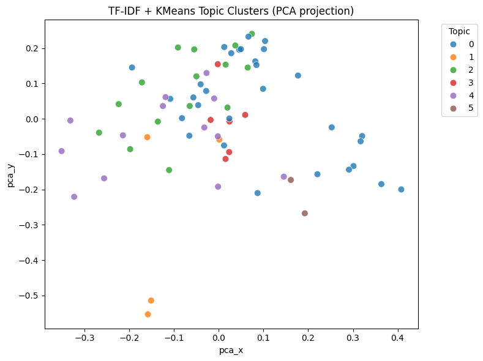
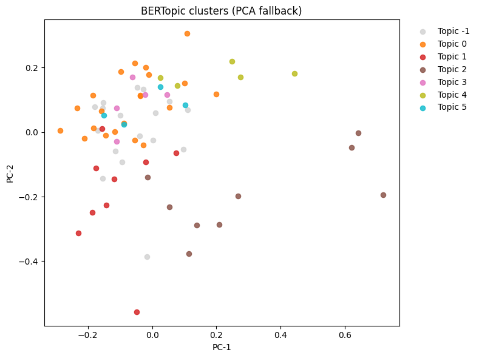

# 🧬 Genomic Text Curation & Topic Grouping

A lightweight NLP pipeline for 20–100 short biomedical texts (e.g., abstracts).  
It extracts **variants**, **genes**, **diseases**, detects **simple relations**, and groups texts into topics for fast human curation.

---

### ❓ Why This Project

Small teams often need a quick, reproducible way to structure small corpora without heavy infrastructure.  
This repository provides a **practical baseline** you can run in minutes.

## ⚙️ Setup & Run

✅ **Step 1. Install Dependencies**

pip install pandas scikit-learn matplotlib seaborn
pip install sentence-transformers bertopic

vbnet
Copy code

🧾 **Step 2. Input Format**  
Create a file at `data/text.csv` with one column named `text`.

Example:

text
"The APOE ε4 allele increases the risk of Alzheimer’s disease."
"Variants rs429358 and rs7412 define APOE isoforms associated with AD."

markdown
Copy code

🚀 **Step 3. Run Notebook**  
Open `genomic_text_curation.ipynb` in **Jupyter** or **Google Colab**,  
then execute all cells sequentially.

**Outputs generated:**
- `extracted_entities_full.csv`
- `curated_results.json`
- `topic_model_tfidf.csv`
- `topic_model_bertopic.csv`

Plots are saved under `images/` (e.g., `kmeans_topics.png`, `bertopic_topics.png`)

## 🧠 Description of Extraction and Topic Methods

### 🧬 1. Entity Extraction

Each input sentence is processed using **regular expressions** and **SpaCy’s biomedical language model** to extract structured entities.  
The extraction focuses on three major categories:

| Entity Type | Example | Detection Method |
|--------------|----------|------------------|
| Variant IDs | `rs429358`, `rs7412` | Regex pattern `r'rs\d+'` |
| Gene Symbols | `APOE`, `APP`, `MAPT` | Uppercase word filtering + biomedical lexicon |
| Diseases | `Alzheimer’s disease`, `Type 2 Diabetes` | SpaCy named entity recognition + capitalization heuristics |

All extracted entities are stored in `extracted_entities_full.csv` with columns:  
`text`, `gene`, `variant`, `disease`, and `relation_context`.

---

### 🧩 2. Relation Detection

Simple **pattern-based matching** is used to infer possible relations between entities.  
For instance:

- `"APOE ε4 allele increases the risk of Alzheimer’s disease"`  
  → Relation: *(gene → disease)*  
- `"Variants rs429358 and rs7412 define APOE isoforms"`  
  → Relation: *(variant → gene)*  

These extracted relations are saved in `curated_results.json` for downstream curation.

---

### 🧠 3. Topic Modeling

Two topic modeling pipelines are implemented for flexibility and comparison:

| Method | Vectorization | Clustering | Output File |
|--------|----------------|-------------|--------------|
| **TF-IDF + KMeans** | scikit-learn `TfidfVectorizer` | `KMeans(n_clusters=k)` | `topic_model_tfidf.csv` |
| **BERTopic** | Sentence-BERT embeddings (`all-MiniLM-L6-v2`) | HDBSCAN + UMAP | `topic_model_bertopic.csv` |

Each document is represented in embedding space and grouped into semantically coherent clusters.  
Visualization plots (e.g. `kmeans_topics.png`, `bertopic_topics.png`) show keyword distributions and topic similarity.

---

### 📊 4. Outputs Summary

| File | Description |
|------|--------------|
| `extracted_entities_full.csv` | Raw entities and their occurrence contexts |
| `curated_results.json` | JSON mapping of detected relations |
| `topic_model_tfidf.csv` | TF-IDF topic assignments per text |
| `topic_model_bertopic.csv` | BERTopic clustering and probabilities |

---

### ⚡ 5. Reproducibility

All methods are deterministic given the same random seed.  
Both pipelines can be reproduced by running:

```bash
python scripts/run_extraction.py
python scripts/run_topic_modeling.py
```
---

## 🧾 Curation Schema (Fields and Why They Matter)

### 🧬 1. `extracted_entities_full.csv`
This file contains one row per processed sentence with extracted entities and contextual information.

| Field | Type | Example | Why It Matters |
|---|---|---|---|
| `text_id` | `int` | `12` | Unique identifier for cross-referencing. |
| `text` | `str` | `"The APOE ε4 allele increases the risk of Alzheimer’s disease."` | Keeps original context for verification. |
| `gene` | `str` | `APOE` | Links extracted variants to genetic markers. |
| `variant` | `str` | `rs429358` | Enables variant-level analysis. |
| `disease` | `str` | `Alzheimer’s disease` | Connects genomics to phenotype. |
| `relation_context` | `str` | `"APOE ε4 increases the risk of AD"` | Captures phrasing for curator review. |

---

### 🍀 2. `curated_results.json`
Structured triples for downstream processing or knowledge-graph ingestion.

**Example:**
```json
{
  "relation_id": 5,
  "gene": "APOE",
  "variant": ["rs429358", "rs7412"],
  "disease": "Alzheimer’s disease",
  "relation_type": "gene–disease association",
  "source_text": "Variants rs429358 and rs7412 define APOE isoforms associated with AD."
}
```
| Field | Type | Why It Matters |
|--------|------|----------------|
| `relation_id` | `int` | Stable handle to deduplicate/link relations. |
| `gene` | `str` | Biological anchor for ontology mapping. |
| `variant` | `list[str]` | Supports multiple polymorphisms. |
| `disease` | `str` | Core clinical entity. |
| `relation_type` | `str` | Semantic class (e.g., variant→gene, gene→disease). |
| `source_text` | `str` | Preserves textual evidence for auditability. |

---

### 📊 3. Topic Model Outputs

| File | Key Fields | Purpose |
|------|-------------|----------|
| `topic_model_tfidf.csv` | `text_id`, `topic_id`, `top_keywords` | Interpretable clusters via TF-IDF + KMeans. |
| `topic_model_bertopic.csv` | `text_id`, `topic_id`, `topic_prob`, `representative_terms` | Semantic clusters using Sentence-BERT embeddings. |

---

### 🧠 4. Why This Schema Matters

Bridges **unstructured text** and **structured data**.  

Enables fast triage: gene–disease mining, variant co-occurrence, topic grouping.  

Ensures **reproducibility & transparency** — every record links back to its source sentence.  

---

---

## 📊 5. Results & Visualization

Below are representative visualizations of the topic clustering results.

---

## 📄 Sample JSON Output Preview

```json
[
  {
    "text_id": "T0000",
    "variant": "",
    "gene": "AD",
    "phenotype": "Alzheimer",
    "relation": "associated with",
    "evidence_span": "netic landscape of Alzheimer's disease (AD). The identified and/or confirmed 19 single-nucleotide polymorphisms (SNPs) a"
  },
  {
    "text_id": "T0000",
    "variant": "",
    "gene": "DNA",
    "phenotype": "Alzheimer",
    "relation": "associated with",
    "evidence_span": "iated with AD are located on non-coding DNA regions, and their functional impacts on AD are as yet poorly understood. We"
  },
  {
    "text_id": "T0000",
    "variant": "",
    "gene": "IGAP",
    "phenotype": "Alzheimer",
    "relation": "associated with",
    "evidence_span": "tional Genomics of Alzheimer's Project (IGAP) is a consortium for characterizing the genetic landscape of Alzheimer's di"
  }
]
```
---

### 🧩 TF-IDF + KMeans Topic Clusters

*Scatter plot of document embeddings reduced via PCA and clustered by KMeans.  
Each color represents a distinct topic derived from TF-IDF features.*

---

### 🤖 BERTopic Clusters

*BERTopic visualization (PCA fallback).  
Sentences are embedded with Sentence-BERT and grouped into coherent semantic topics.*

---

---

## 🧩 Discussion of Limitations & Next Steps

### ⚠️ Limitations

1. **Entity extraction relies on surface patterns.**  
   Current extraction depends on simple regex and capitalization rules (e.g., `rs\d+`, uppercase gene names).  
   This misses implicit mentions (e.g., “ApoE4 variant”) and can falsely detect non-biological entities.

2. **Relation extraction is pattern-based.**  
   Relation phrases (e.g., *associated with*, *linked to*) are rule-defined.  
   Complex syntax or negations (“not associated with”) are not handled robustly.

3. **No ontology-level normalization.**  
   Entities such as “APOE ε4”, “ApoE4”, and “APOE4” are treated separately, lacking mapping to standard vocabularies (HGNC, MeSH, ClinVar).

4. **Topic modeling sensitivity.**  
   TF-IDF + KMeans and BERTopic can produce noisy clusters on small corpora or unbalanced text segments.

5. **Lack of evaluation & expert validation.**  
   No benchmarked accuracy or domain expert feedback is currently integrated.

---

### 🚀 Next Steps

1. **Integrate biomedical NER models.**  
   Replace rule-based extraction with BioBERT, SciSpacy, or PubMedBERT for entity recognition.

2. **Enhance relation extraction.**  
   Introduce transformer-based classification (e.g., BioBERT relation models) to detect negation and syntactic dependencies.

3. **Entity normalization pipeline.**  
   Map extracted entities to HGNC, MeSH, or dbSNP identifiers for consistent cross-document linking.

4. **Improve topic modeling robustness.**  
   Use contextual embeddings (Sentence-BERT + UMAP + HDBSCAN) and evaluate with topic coherence metrics.

5. **Add evaluation & human-in-the-loop review.**  
   Build a lightweight annotation interface for expert curation and quality auditing.

6. **Integrate with downstream systems.**  
   Feed curated results into biomedical knowledge graphs (e.g., Neo4j) or semantic search pipelines.

---

*These steps aim to evolve the current pipeline from a lightweight prototype into a scalable, ontology-aware biomedical text curation system.*

